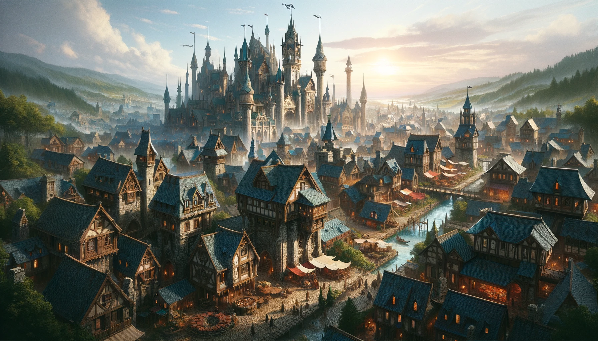

# Meridian's Crest

Meridian's Crest, a city renowned for its strategic location at the crossroads of major trade routes, is a vibrant blend of cultures, magic, and technology. Though not sprawling, its bustling marketplace, mage towers, and proximity to the Enchanted Forest of Misdirection make it a focal point for adventurers, scholars, and traders alike. This smaller city prides itself on being a community where diverse traditions thrive and the potential for discovery lurks around every corner. Here, the spirit of adventure mingles with the whispers of the forest, promising both treasures and mysteries for those brave enough to explore.

## Laughing Beholder
